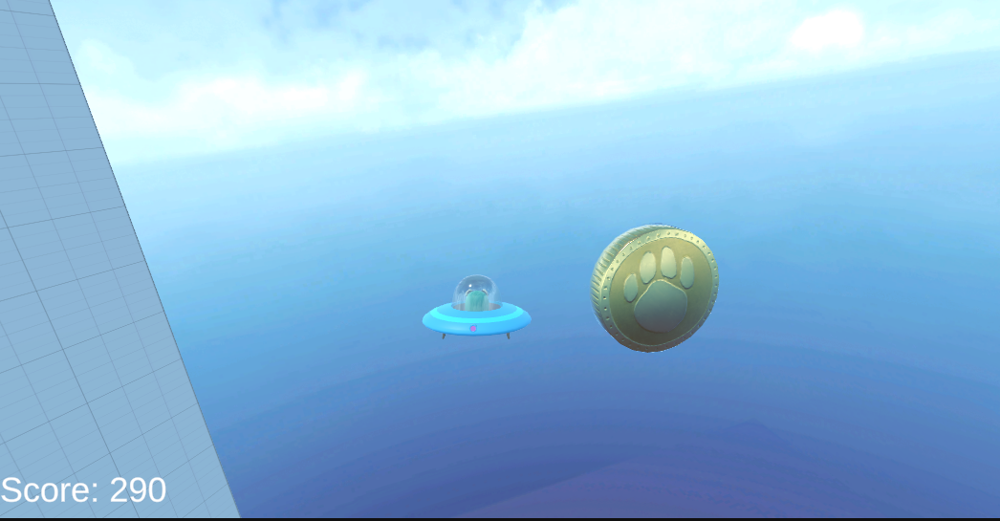
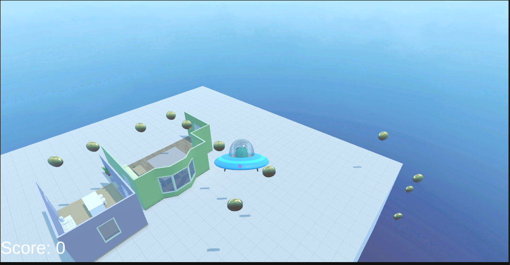

# Iot-unity-coin-game
Iot 개발자 코인 게임

# 🛸 UFO Coin Collector

마우스와 키보드로 UFO를 조종하며 코인을 수집하는 3D 비행 게임입니다.

## 📂 프로젝트 구조

각 스크립트 파일을 통해 게임의 핵심 기능을 확인할 수 있습니다.

| 파일명 | 기능 설명 |
| :--- | :--- |
| **[UFOMovement.cs](/CoinPathGame/Assets/Script/PlayerController.cs)** | 마우스 회전 및 비행 물리 엔진 (수평 보정 포함) |
| **[Collectible.cs](/CoinPathGame/Assets/Script/Collectible.cs)** | 코인 회전, 수집 효과(VFX) 및 점수 연동 |
| **[GameManager.cs](/CoinPathGame/Assets/Script/GameManager.cs)** | 전체 점수 기록 및 UI 실시간 업데이트 |

## 🚀 조작 방법 (Controls)

* **이동**: `W`, `A`, `S`, `D`
* **고도 조절**: `Space` (상승), `Left Shift` (하강)
* **시점 전환**: 마우스 움직임

## ⚙️ 주요 특징

* **자동 자세 제어**: 어떤 방향으로 이동해도 UFO가 수평을 유지하도록 보정됩니다.
* **실시간 UI**: 코인을 수집할 때마다 화면 상단의 Score가 즉시 업데이트됩니다.
* **최적화**: 수집 후 생성되는 폭발 효과는 2초 후 자동으로 삭제되어 메모리를 관리합니다.

## 💡 개발 환경
* **Unity Version**: 2022.3 LTS 이상 권장
* **Language**: C#

---

